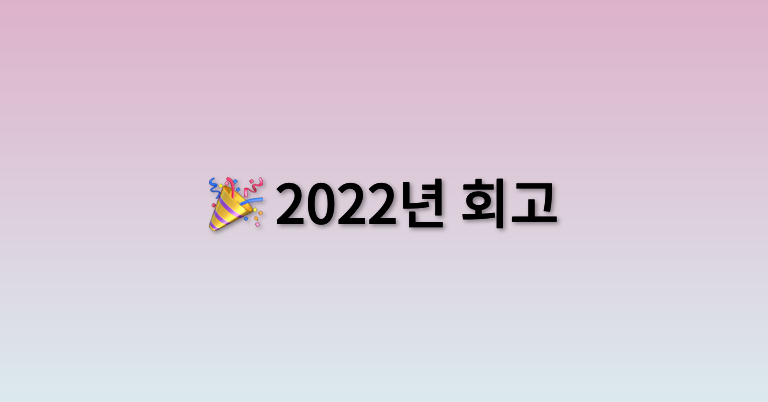

2022년 나의 인생은 많이 달라졌다. 원래는 회고 글을 작성하지 않았었는데, 내년을 위해 또 지금의 나를 위해 정리하고 목표를 세우는 것이 좋을 것 같아
회고록을 작성하게 되었다.

## 🧩 2022년에는 무슨 일이 있었을까?

### 🎯 여러 동료와의 작별

지난 포스팅에 있는 내용이긴 하지만, 회사의 소속이 변경되면서 2년간 함께 일한 동료가 이직하였다.
신입으로 입사하여 많이 배우고, 함께 많은 것을 이뤄낸 것 같다.

처음으로 동료와 작별한 것이기 때문에 아쉬움도 많이 남는다. 언젠가는 더 좋은 환경에서 다시 함께 서비스를 만들며 즐겁게 일할 수 있으면 하는 바람이다.

### 🎯 DND 동아리 참여

지금까지 나는 여러 동아리를 이끌어는 봤지만 다른 사람이 주최하는 동아리에는 참여해본 경험이 없다. 

올해 개발을 하면서 다른 회사에 다니는 분들과 함께 서비스를 제작해보고 싶다는 생각에 `DND`라는 동아리에 참여하게 되었다.

평소에 Github와 블로그로만 접했던 분들과 서비스를 함께 만들며 즐거웠지만, 중간에 내가 건강이 심하게 악화되기도 했고, 서비스 주제도 애매해져 
완벽하게 수행하지 못했던 것 같아 많이 아쉬움이 남는다.

다음에 `DND`나 다른 프로젝트를 진행하는 곳에 참여한다면 더 재밌고, 즐겁게 참여하고 싶다.

### 🎯 처음으로 해보는 휴직

위에 적혀있듯이 올해 8월부터 휴직을 하게 되었다. 휴직 사유는 수술준비를 위해서이다.
항상 건강하게 살아가려고 노력했고, 건강에 안 좋은 술, 담배도 하지 않았지만 코로나 이후로 건강이 않좋아졌다.

다른 이유라면 휴직을 하지 않았을 수도 있지만, 병원 소견상 수술이 필요한 상황이었고 올해 안에 진행 예정이었기
때문에 피치 못하게 휴직하게 되었다.

### 🎯 수술은 힘들다

비교적 최근 11월에 수술을 받게 되었다. 

10월 중에 일주일 정도 입원하여 수술 전 검사를 진행하게 되었고, 원래는 수술 대기 시간 때문에 내년 1월 중에 수술 예정이었지만,
중간에 공석이 생겨 11월에 수술을 예정하게 되었다.

수술은 평소 겁이 많지 않은 편이어서 생각보다 안 아프겠지 생각하고 수술을 받게 되었는데, 예상과는 하필 다르게 엄청나게 아팠다.

수술을 하고 10일 정도 입원해있었으며 현재는 퇴원한 상태로 집에서 건강 회복을 하고 있다. 이제는 수술 통증도 없고 수치도 나름 안정적이어서
한 달에 한번 병원에 가서 검사를 받는 것 빼고는 정말 아무렇지 않아졌다.

단 수술 후 면역억제제라는 약을 먹게 되어 최소 3~4개월간은 외출제한을 받게 되었다. 완벽한 E형 인간인 나는 참으로 답답하지만
건강을 위해서 운동과 여자친구와 동네 데이트를 할 때 빼고는 외출을 자제하고 있다. 

## 🧩 2023년의 계획

### 🎯 건강 회복하기

2023년에는 건강을 가장 중요시하는 한해를 만들고 싶다. 항상 건강보다 성장에 내 인생을 두었고, 조금이라도 열심히 성장하려고 노력했었다.

하지만 수술을 받고 난 이후 생각해보니, 건강해야 내가 하고 싶은 개발 또 성장할 기회가 모두 주어진다는 것을 깨닫게 되었다.

2023년은 건강한 한해를 만들기 위해서 식단조절도 할 것이고, 운동도 할 것이다. 예전에 정말 열심히 했었던 복싱이나 주짓수를 다시 시작할 예정이다.

### 🎯 공부하기

8월 휴직 후 10월까지는 공부는 아니고 DND나 개인적인 공부를 진행해왔었는데 11월부터는 수술 탓에 공부를 하지 못하였다. 

2023년에는 내가 하고 싶은 개발공부를 더 열심히 할 것이다. 최근 `megatera`라는 교육기관에 프론트엔드 강좌를 신청해두었다. 평소
사용은 하였지만 제대로 알지 못하고 사용하였던 `TDD`와 `테스트코드 작성하기`를 배우고 싶어 큰 금액이고 짧지 않은 시간이지만 신청하게 되었다.

투자를 많이 했기 때문에 최대한 재밌고 열심히 공부할 것이며 2023년에는 내 개발인생에서 가장 큰 성장을 하는 한 해로 만들 것이다.

### 🎯 서비스 런칭하기

사이드 프로젝트를 런칭하고 싶다. 내년에는 B-Side나 여러 사이드 프로젝트 플랫폼을 활용하여 프로젝트를 런칭할 예정이다.

### 🎯 해외 여행가기

원래 내년에 수술 예정이었기 때문에 올해 10월이나 11월에는 일본 여행을 예정하고 있었다. 하지만 수술 일정이 급하게 앞당겨지는 바람에
해외여행을 가지 못하게 되었다. 2023년에는 일본을 포함한 해외여행을 꼭 가고 싶고, 꼭 가서 쇼핑도 마구마구 하고 싶다.😋

### 🎯 ebook 제작하기

요즘은 집에 있다 보니 개발서적을 읽는 게 참 재밌다. 원래 나는 공부를 강의로 하거나 외부 문서를 읽으면서 공부를 하는 편이지 책을 자주 보는 편은
아니었다. 최근에 책을 읽다 보니, 책만큼 지식을 많이 주는 수단이 없다고 느끼게 되었고 나도 한번 책 좀 써봐야겠다는 생각이 들었다.

항상 나는 교육 쪽에 관심이 많았다. 그렇기 때문에 고등학생 개발자 또는 대학생 개발자분들이 읽으면 도움될만한 책을 꼭 쓰고 싶었다.

2023년에는 꼭 학생 FE 개발자들이 읽으면 도움될 전공 ebook을 제작할 것이고, 모교에도 꼭 배포하여 많은 학생에게 도움을 주는 사람이 되고 싶다.

### 🎯 블로그 한 달에 2회 포스팅하기

블로그를 한동안 쓰지 못하였다. 휴직도 있고 수술도 있었지만 2023년에는 블로그를 더욱 열심히 해보고 싶다.

여자친구와 습관 내기를 하였기 때문에 2주에 1회는 꼭 포스팅할 예정이며 재밌는 개발 내용 흥미로운 개발 내용을 포스팅할 것이니 기대하면 좋을 것이다.

## 🧩 마무리

올해는 참으로 바쁘고 아프고 힘들었던 한해였다. 그래서 회고를 작성하게 되었고, 이제는 매년 정리하는 마음에서라도 회고를 매년 작성해야겠다.

내년에는 나를 포함한 모든 개발자분이 모두 건강하고 행복한 코딩 하였으면 좋겠다...!😆

 
