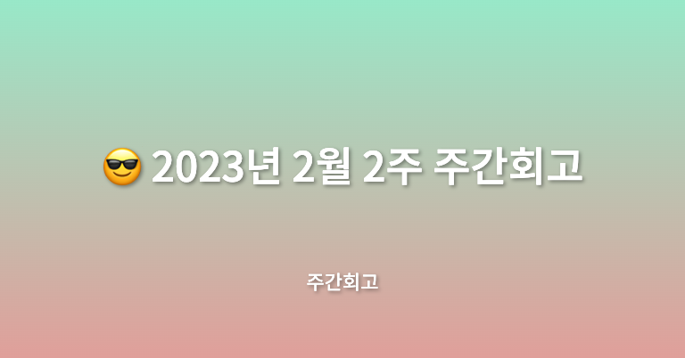

## 🤷‍♂️ 이번주에는?

이번 주에는 메가테라와 비사이드프로젝트를 함께 진행했다. 저번 주보다 바빴지만 새로 만난 분들과 소통할 기회가 있어 뜻깊었고, 또 내가 성장할 수 있는 길을 확인할 수 있었던 것 같아 느낀 점이 많은 것 같다. 이번 주부터 다음 달에 일본 여행을 위한 일본어 공부도 시작했다.

## ✅ 배운점

메가테라에서 2주차에는 JSX에 관해 공부했다. React를 제대로 공부하려면 JSX와 Vdom에 대해 알아야 하므로 이에 대한 학습을 진행했다. 지난주에 이어서 아직은 복습 과정이지만 Vdom의 사용이유 등을 학습하며 개념적인 것을 많이 배운 것 같다. 항상 알고 있는 내용이라고 생각은 했지만 누가 물어보면 뭔가 완벽하게 답변하진 못했던 것 같은데. 이번 학습을 통해 개념에 대해 자세히 공부하면서 완벽하게 답변할 수 있는 능력을 기른 것 같다.

## ✅ 느낀점

메가테라에서 JSX를 오랜만에 공부하며 React를 완벽하진 않지만 오랜만에 만들어보았다. 3년 전에 우아한 테크 러닝에서 잠깐 공부한 적이 있던 것인데, 지금 하니까 내 실력이 그때보다 성장해서 그런지 만들기도 수월하고 이해가 금방금방 돼서 신기했다. 복습 과정이었지만 JSX나 Vdom에 대해서 자세히 공부하는 과정을 통해 React의 기본에 관해서 공부할 수 있어 큰 도움이 되었고 뜻깊은 한 주였다.

비사이드 프로젝트에서는 첫 번째 팀 회의에서 새로운 분들과 만나면서 많은 것을 느꼈다. 나와 비슷한 연차의 개발자, 기획자, 디자이너분들과 이야기를 나눠보면서 정말 노력하는 사람들이 많구나 한 번 더 느낀 것 같다. 최근에 건강 때문에 콘퍼런스 같은 행사에 참여하지 못해 다른 직군이나 다른 개발자분들과 소통할 기회가 적어 아주 아쉬웠는데 비사이드 회의를 진행하는 것이 너무 좋았고, 자극받아 나도 성장을 위해 매일 매일 노력해야겠다고 생각하게 된 것 같다. 14주라는 기간 동안 팀원들과 프로젝트를 진행하게 되는데 정말 나와 팀원들이 원하는 방향으로 성장할 수 있는 시간이 되면 좋겠고, 무엇보다 함께 좋은 서비스를 만들어 보고 싶다는 생각이 들었다.

## ✅ 정리

이번 주는 저번 주보다 많이 바쁘게 보낸 것 같다. 다음 주에는 지금 하는 프로젝트 공부와 더불어 [리팩터링](http://www.yes24.com/Product/Goods/89649360) 책을 읽고, 코딩테스트 공부도 다시 시작할 것이다. 5~6월에는 다시 회사에서 개발하는 것이 목표이기 때문에 조금은 더 노력해야겠다. 다른 것보다 건강이 중요한 것을 누구보다 잘 알기에 운동도 열심히 하는 한 주를 만들어야겠다.