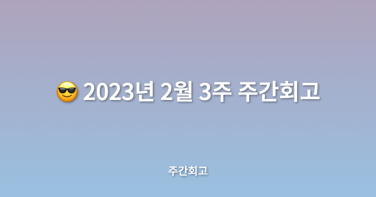

## 🤷‍♂️ 이번주에는?

이번 주에는 원래 메가테라와 비사이드프로젝트와 더불어 책 스터디와 코딩테스트 공부를 다시 시작하려고 하였다. 하지만 몸이 조금 좋지 않아 병원 일정이 생기게 되었고 그로 인해 메가테라와 비사이드는 진행했지만 다른 것들은 진행하지 못하였다.

## ✅ 배운점

메가테라에서는 3주차에 React의 기본 개념들을 학습하였다. React 컴포넌트를 어떤 식으로 만들면 되고, Props나 State는 어떻게 사용하면 되는지에 대해서 학습하였다. 물론 너무나 잘 알고 있는 내용이었지만 예전에 처음 회사에 입사했을 때 사수한테 컴포넌트 쪼개기에 대해서 제대로 배운 적이 있는데 그 기억이 새록새록 나면서 공부해서 그런지 남다르고 의미있었다.

비사이드에서는 아이디어 회의를 진행하였다. 비사이드 이전에 개인적인 동아리나 DND에서 아이디어 회의를 자주 진행하였기 때문에 비슷한 방식으로 진행되지 않을까 싶었지만, 비사이드에는 기획자분들도 계시고 해서 그런지 아이디어 회의 진행이 조금은 더 수월하게 진행된 것 같다. 항상 나는 아이디어 기획을 할 때 머릿속에 있는 것을 그냥 풀어쓴다는 느낌으로만 작성하고 어떤 점들을 미리 생각하면 좋을지 고민했었는데 이번에 회의를 진행하며 기획자분들이나 다른 분들에게 많이 배운 것 같다. 다들 좋은 아이디어를 가지고 오셔서 뜻깊은 회의였다.

## ✅ 느낀점

메가테라에서 React Component와 React State에 대해 오랜만에 공부하며 복습이었지만 정리하는 느낌으로 공부해서 그런지 도움이 되는 한주였다. 다만 아쉬운 점은 프론트엔드 개발자마다 다르고 항상 궁금해하는 점인 프로젝트를 개발할 때 디렉터리 구조를 어떤 식으로 해야 하는지에 대한 것을 배웠으면 좋겠는데 그 점은 이번 주 강의내용에 없어 아쉬웠다. 개인적인 바람으로 프로젝트 구조를 어떤 식으로 잡는지 배우고 싶고, 교육과정 안에 포함되어 있으면 좋겠다는 생각을 가졌다.

## ✅ 정리

이번 주는 생각지도 못한 병원 일정으로 인해 힘든 한 주였다. 원래 계획했던 책 읽기와 코딩테스트 공부도 진행하지 못해서 아쉬운 한 주이다. 그래도 이번 주에는 메가테라에서도 지난주보다 배운 게 많은 한 주였고, 비사이드에서는 아이디어를 구상해보면서 내가 만들고 싶은 아이디어를 생각해보게 된 계기가 되었다. 여러 아이디어가 생각났지만 외적으로 내가 좋아하는 신발이나 옷 관련한 프로젝트를 한번 진행해보고 싶다는 생각이 들었다. 다음 주에는 운동도 공부도 프로젝트도 더 열심히 해야겠다.