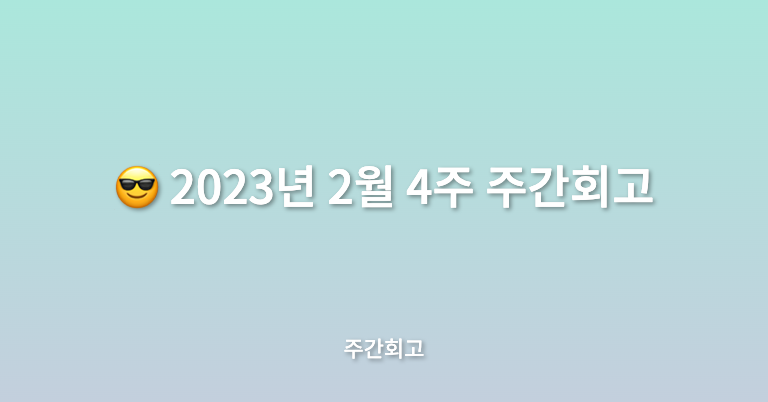

## 🤷‍♂️ 이번주에는?

이번 주에는 메가테라와 비사이드프로젝트를 진행하였고, 최근에 너무 전공 책은 읽었지만 다른 책은 읽지 않은 것 같아 독서를 시작하게 되었다. 아직 몸이 덜 회복된 건지 많이 피곤함이 몰려와서 힘은 들었지만 잘 진행한 것 같다.

## ✅ 배운점

메가테라에서는 4주차에 Express로 서버 만드는 법과 서버와 통신하는 방법, React Hook과 Custom Hook에 관해서 공부하였다. 먼저 Express 서버의 경우 예전 델리툰 서비스할 때 Admin 페이지 건든 이후로 한 2년 만에 한 거라 낯설었지만, 기초만 배운 것이라 쉽게 진행할 수 있었다. Hook의 경우는 Custom Hook으로 항상 빼서 작업하기 때문에 어렵지 않게 진행할 수 있었는데 예전에 길고 복잡한 코드를 Custom Hook을 사용하여 로직을 분리해서 서비스하던 프로젝트 코드를 많이 바꿔놨었는데 그 기억들이 많이 났다.

비사이드에서는 아이디어 선정과 프론트엔드 개발자분과 회의를 진행하였다. 기술스택 선정을 진행했는데 최대한 트렌드한 기술을 쓰려고 이야기를 하다 보니 너무 내 위주가 된 것 같아 같이 개발하시는 분께 죄송한 마음도 들었다. 프로젝트에 선정하는 기술들에 대해서 왜 선정하게 되었는지 장단점은 무엇인지 문서로 정리를 해야 하는데 약간의 나의 귀찮음으로 정리는 아직 못하였지만, 빨리해야겠다.

## ✅ 느낀점

이번 주에 공부하며 아직 복습내용이기 때문에 어려운 점이나 특별하게 느낀 점은 없던 것 같고, 비사이드를 진행하면서 더 효율적으로 프로젝트를 진행하려면 어떻게 해야 할까 많이 고민하게 된 한 주였다. 다른 개발자분들 기획자, 디자이너분들의 열심히 하시는 모습을 보며 자극도 많이 받았고, 좀 더 노력해야겠다는 생각도 들었다.

## ✅ 정리

이번 주는 예정대로 진행은 했지만 메가테라 데브노트 정리와 문서 정리를 제대로 하지 못한 것 같아 아쉬운 한 주이다. 항상 문서정리가 중요한 걸 알면서도 알고 있다고 생각하고 넘어가는 느낌이라 이러한 점을 고쳐야겠다고 생각이 들었다. 다음 주는 본격적인 프로젝트 시작과 메가테라에서 테스트를 배우기 때문에 더 열심히 살아봐야겠다.