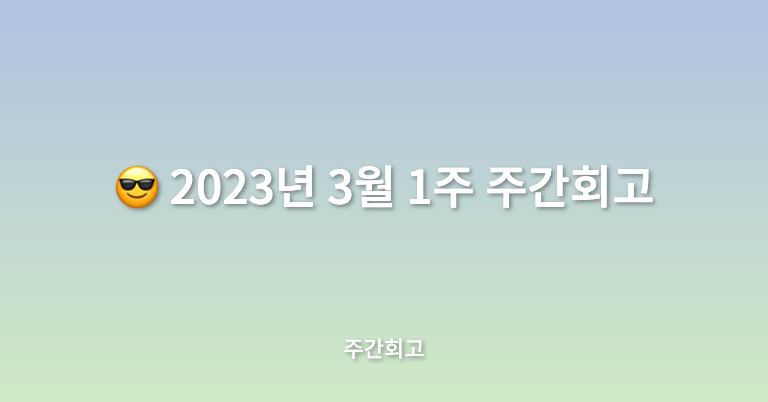

## 🤷‍♂️ 이번주에는?

이번 주에도 마찬가지로 메가테라와 비사이드 프로젝트를 진행하였다. 더불어 이번 주에 잘한 게 있다면 운동을 다시 시작하게 되었다. 체력이 많이 떨어진 것 같아 공부도 중요하지만 운동을 다시 시작하였다. 하루에 최소 1시간 이상씩 스테퍼와 걷기를 하고 있다.

## ✅ 배운점

메가테라에서 5주차에는 드디어 내가 배우고 싶은 Test에 대해서 배우게 되었다. 인터넷 강의들로 기초와 컨퍼런스 영상들로 Test와 TDD에 대한 기본 개념만 알고 있었는데 제대로 배운 게 이번이 처음이었다. TDD를 왜 진행하고 왜 해야 하는지에 대해 학습했고, Jest + React Testing Library를 통한 React 테스트, MSW를 만들어 백엔드 서버가 만들어지기 전에 테스트하는 방법, Playwright를 통한 빠르게 E2E 테스트하는 방법에 대해서 배웠다.

Jest + React Testing Library를 통한 테스트는 그동안 학습하고 진행해와서 그런지 쉬웠다. TDD는 개념에 대해서는 자세히 알고 있었지만 실천을 못 해왔었는데 역시나 복습이 중요한 걸 깨달은 것 같다. 그리고 E2E Test의 경우 Cypress를 통한 간단한 E2E만 진행해보고 실무에서는 활용해보지 못했었다. 메가테라에서는 Playwright를 활용한 E2E Test를 학습했는데 Playwright를 처음 들어봐서 관심이 생겼고 비교해보니 Cypress보다 훨씬 더 빠른 E2E테스트가 가능하다고 해서 흥미가 생기고 꼭 활용해봐야겠다는 생각이 들었다.

## ✅ 느낀점

이번 주는 내가 메가테라를 신청한 이유를 공부한 것이기 때문에 흥미를 가지고 공부했던 것 같다. 더불어 현재 진행하고 있는 프로젝트에도 테스트를 적용할 것이기 때문에 더 관심을 가지고 학습에 임한 것 같다. 항상 개념들은 알고 있었지만 실천하지 못하고 복습하지 못한 것을 후회하게 되었고, 앞으로는 꼭 실천하며 반복 학습해야 하겠다는 생각이 들었다.

## ✅ 정리

이번 주는 흥미 있는 한주였지만 아쉬운 점은 비사이드 팀원들이 모임을 진행했지만 나는 아직은 먼 곳까지 외출이 불가능한 상태라 참여하지 못한 게 가장 아쉬웠던 것 같다. 기획자, 디자인분들도 그렇고 다른 개발자분들과 이야기하고 소통하는 걸 굉장히 좋아하기 때문에 참여하면 좋은 경험이 되었을 텐데 그 점이 아쉬운 것 같다. 다음에는 꼭 함께 모였으면 좋겠다. 다음 주는 한주가 좀 바쁠 것 같지만 조금 더 열심히 살아봐야겠다.
