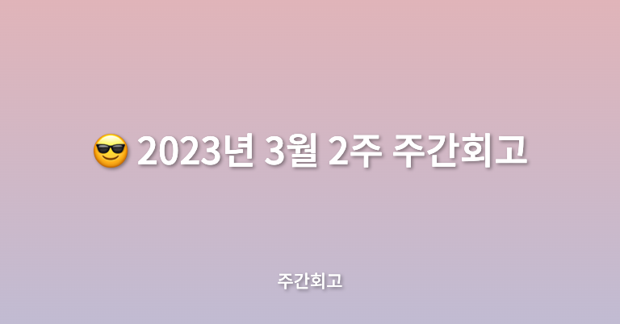

## 🤷‍♂️ 이번주에는?

이번 주에는 예정하던 일정은 제대로 소화를 못 하고 바쁘게 진행한 것 같다. 공부를 제대로 진행은 못했지만 메가테라 강의와 비사이드 프로젝트는 어찌저찌 진행한 것 같다.

## ✅ 배운점

메가테라에서 6주차에는 상태관리에 대해 배웠다. 상태관리에 대한 것은 항상 고민하고 어떤 도구를 쓸지 항상 고민하던 문제라 관심 있게 공부한 것 같다. Redux를 할 줄 알았는데 관심사의 분리와 External Store, TSyringe, usestore-ts와 redux를 비슷하게 만들어보는 것으로 진행되었다. 전역 상태를 어떻게 관리하는지와 관심사의 분리에 대해서 집중적으로 배운 것 같다. 그리고 시드웨일에서 개발한 `usestore-ts` 를 사용해보면서 쉽게 store를 만드는 방법에 대해 배우고, 원리에 대해 배웠다.

## ✅ 느낀점

원래 회사에서는 `redux` 를 많이 사용했었고, 최근 많이들 사용하는 `recoil` 에 관심을 가지고 있었는데, 클라이언트 전역 상태를 관리하기 위해는 어떤 것이 필요하고 특히 관심사의 분리가 중요하다는 것을 다시 한번 깨닫게 된 것 같다. 개념에 대해 계속 잊어먹고 있는데 복습도 해보면서 개념을 머리에 제대로 박아둬야겠다.

## ✅ 정리

이번 주는 몸이 좀 고됬다. 원래 비사이드 프로젝트도 화요일 정규 회의 날인데 참여를 못 했고, 개발 환경 설정도 `3/14` 안에 다 세팅해놔야 하는데 바빠질 것 같다.
