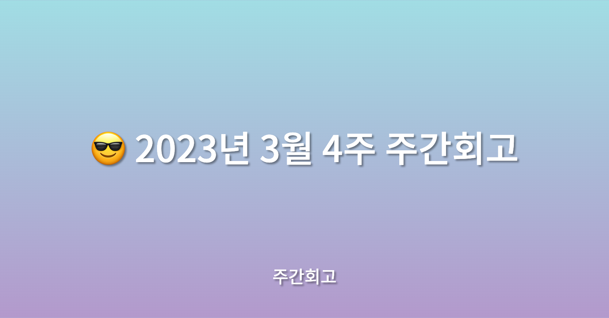

## 🤷‍♂️ 이번주에는?

이번 주는 3월 중 가장 바빴던 것 같다. 메가테라에서 진행하는 학습과 더불어, 현재 진행 중인 프로젝트의 첫 번째 스프린트 마지막 날이 가까워서 정말 바쁘게 한 주를 보낸 것 같다.

## ✅ 배운점

메가테라에서 8주차에는 Style에 관한 전반적인 것을 학습하였다. `Design System` 에 대해 학습하고, React에서 Style 작업을 할 때는 어떻게 하는 것이 좋은지 학습하게 되었다. 중점으로 배운 것은 `styled-components` 에 대해 배웠는데 `emotion` 과 `styled-components` 를 몇 년간 계속 사용해 왔기 때문에 어렵거나 새로운 점이 없었던 것 같다. 다만 현재 프로젝트도 그렇고 회사에서도 `dark-mode` 를 도입 안 하다가 중간에 도입했을 때 정말 귀찮고, 안 좋은 기억이 많은데 그런 추억들이 새록새록 나고, 현재 프로젝트를 진행할 때 사용하는 기술이라 겸사겸사 복습하기 좋았던 것 같다.

비사이드에서 진행하는 프로젝트에서 이번 주에는 `CI/CD` 세팅 마무리와 스프린트 1에 포함된 페이지를 개발하였다. 어려웠던 것은 `CI/CD` 를 회사에서는 인프라팀이 담당하였고, 혼자 프로젝트를 진행할 때는 정말 기본만 작성했었는데 여러 가지를 추가하려다 보니 복잡한 게 많았다. 기억에 남는 것은 `yarn pnp` 에서 `cypress e2e` 테스트를 진행할 때 cypress를 못 찾는 문제를 `[github issue](https://github.com/cypress-io/github-action/issues/430)` 를 뒤지면서 찾은게 기억에 남고, 팀원들과 함께 진행하는 프로젝트인 만큼 최근의 기술을 활용하고 싶어, `chatGPT` 가 코드리뷰를 해주는 ci([ChatGPT-CodeReview](https://github.com/anc95/ChatGPT-CodeReview)) 도 추가하였다. 아직은 개발단계라 그런지 뭔가 애매하고, 막 리뷰를 해주는 느낌이 나긴 한다..😂 아마 `Github` 에서 새롭게 발표한 `github copilot x` 가 사용가능해진다면 거기도 `pr-review` 기능이 있기 때문에 쓰지는 않을 것 같다..!

## ✅ 느낀점

이번 주 느낀 점은 개발안에서도 문서화가 중요한 것 같다. 현재 진행 중인 프로젝트에도 처음에 `Theme` 를 정리해두지 않다가 `dark-mode` 가 추가될 수 있다는 소리를 듣고 급하게 추가하는 작업을 진행했는데, 처음부터 예상하고 진행했으면 더 편하지 않았을까 라는 생각이 든다. 또 느낀 점은 정말 역할의 필요성을 많이 느끼는 것 같다. 조금 규모가 큰 프로젝트를 사이드로 진행하다보니 세팅해야 할 것도 많고 논의해야 될 것도 많고, 정말 바빠진다..!

## ✅ 정리

이번 주도 바빴지만 다음 주도 바빠질 것 같다. 더 열심히 한 주를 살아봐야겠다..!
