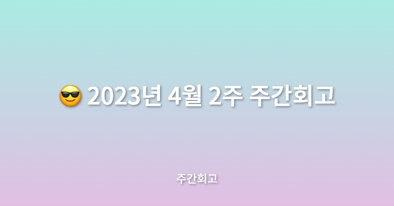

## 🤷‍♂️ 이번주에는?

이번 주는 현재 메가테라와 진행하는 프로젝트에서 똑같이 로그인, 회원가입 관련해서 진행하였다. 신기하기도 하고 도움도 많이 된 한주였다.

## ✅ 배운점

메가테라에서 10주차에는 로그인, 로그아웃, 회원가입과 주문 목록 & 주문 상세에 관한 프로젝트 구현으로 강의가 진행됬다. 이번 주는 복잡하거나 어렵지는 않았지만 프론트에서 인증하는 과정을 훑고 지나간 것 같아 도움이 많이 된 것 같다. 이유는 현재 진행 중인 프로젝트에서 똑같은 기능을 구현 중이기 때문이다. 물론 사용하는 스택은 다르지만 비슷하게 적용할 수 있을 것 같아 도움이 많이 된 것 같다. 또 아샬님이 테스트 코드를 작성하는 것을 보며 테스트 코드 작성하는 방법에 대해서 한 번 더 생각하게 된 것 같다.

## ✅ 느낀점

이번 주는 느낀 점보다는 사실 프로젝트를 빨리빨리 진행하고 있기 때문에 뭘 느낄 수도 없이 후다닥 지나간 것 같다. 느낀 점이 있다면 메가테라에서 모각코를 처음 참여해봤다. 홀맨님이 진행해주셨는데 자극도 많이 된 것 같다. 현재 휴직 중이라 최대한 낮에 회사에서의 업무시간에 프로젝트나 학습에 몰입하고 밤에는 운동하거나 최대한 쉬고 있는데 그런데도 자극은 많이 된 것 같다. 아무리 못해도 일주일에 1~2회는 모각코도 참여하려 한다. 같이 공부하는 분들과 소통도 하고 자극도 많이 받고 싶다.

## ✅ 정리

다음 주에도 열심히 작업을 해야겠다. 한가지 책을 구매했는데 [기술 문서 작성 가이드](https://product.kyobobook.co.kr/detail/S000201419245)라는 책을 구매했다. 현재 프로젝트에서도 그렇고 문서화를 열심히 하는 중인데 보다 더 업그레이드해서 문서를 작성하고 싶기 때문에 구매하게 되었다. 다음 주는 이 책도 함께 읽으면서 한 주를 보내야겠다. 열심히 하자.
