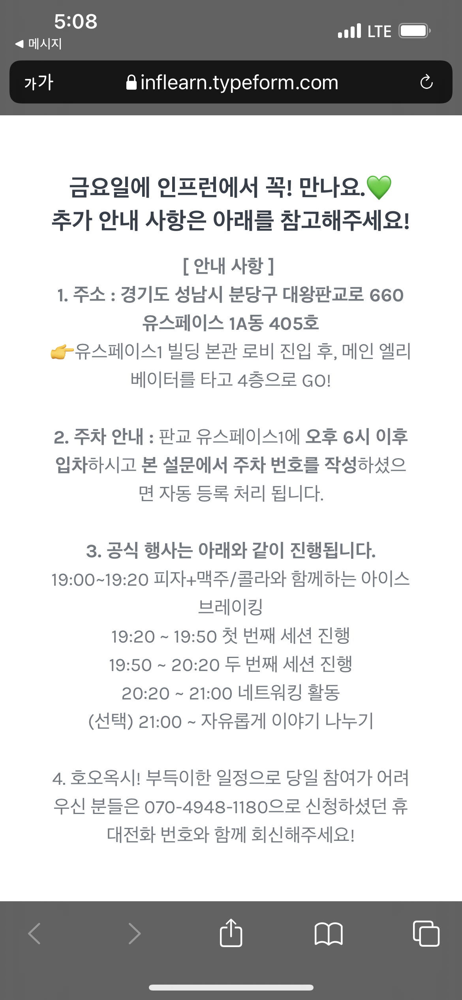
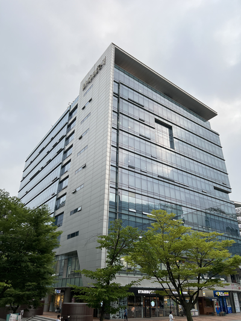
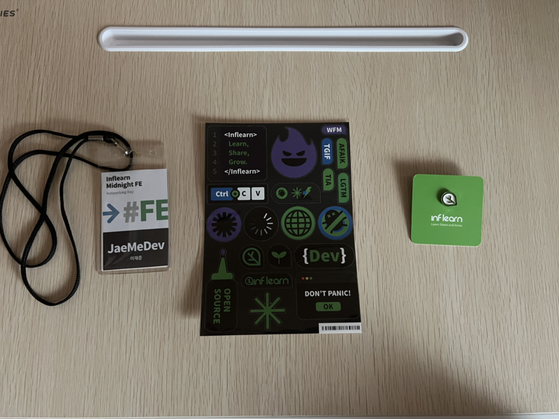
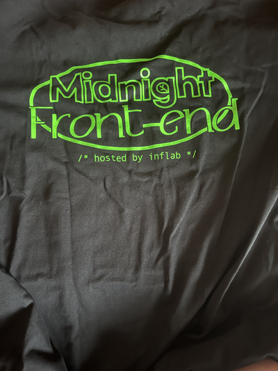

## 인프런 심야 FE에 다녀왔다

인프런에서 웹 최적화에 관한 강의를 듣다가, 공지에 `심야 FE`를 진행한다는 것을 보고 재밌어 보여서 신청하였다.

 

결과는 신기하게도 60명 안에 선정되었다...! 이런 거는 이상하게 잘되는 것 같다. (이런 것 보다 로또 한 번만 되면 좋겠다...🤣)

 

선정 메일과 문자를 받게 되었고, 집과 회사에서 먼거리에 위치해 있는 판교여서 갈까 말까 많이 고민했지만, 요즘 자극받고 싶은 욕구가 강했기 때문에 가기로 결정했다.

 

 

판교... 출발하자.

 

## 인프런에 도착

분명 회사랑 집에서 네이버 맵으로는 1시간 10분이라 해서 넉넉하게 출발했는데 5시10분에 출발했는데 7시 10분에 도착했다. 😅

 

 

생각보다 건물은 작았다. 근데 유스페이스 1만 검색하고 가서 처음에 잘못 들어가서 당황했다.

 

우여곡절 끝에 도착하고 명찰과 뱃지, 스티커, 옷 등의 선물을 받고 뱃지에 표시된 그림에 맞는 테이블로 가서 착석했다.

 

받은 선물은 이러하다.

 

 

강연을 시작하기에 앞서 피자와 음료수를 주는 행사였지만, 아쉽게도 당일 속이 많이 안 좋아서 피자는 먹지 못했다. 

 

## 팀원들과의 첫 만남

아까 배부한 명찰에 있는 그림이 팀이라고 한다. 우리 팀은 한분은 참여하지 않은 것 같았고, 나머지 분들은 
1년 차 2분, 2년 차 한분, 취준생 한 분이었다. 나 혼자 만으로 3년 차 팀원분들 기준으로는 4년 차 개발자였다. 

 

팀원분들 모두 인상도 좋으셨고, 말씀들도 모두 편하게 해주셨다. 간단한 인사와 자기소개 후 첫 번째 강연이 시작되었다.

 

## 첫 번째 강연

첫 번째 강연은 인프랩에서 렐릿을 개발한 조성륜(빠삐코)님이 진행해주셨다. 랠릿을 개발하면서 어떤 우여곡절이 있었고, 기술 스택 선정부터
프로젝트 진행 당시 문제점을 어떤 식으로 해결했는지 발표해주셨다.

 

강연을 듣고 지금 내가 현재 다니는 직장과는 조금은 다른 개발문화를 가진 회사라고 느껴졌고, 지금 우리 회사는 4년 차인 내가 막내고 그 위에 시니어급 
개발자분들이 여러분 있는 구조인 것에 비해, 인프랩은 젊은 주니어 개발자들이 일을 진행하고 새로운 문제를 함께 해결해가는 방식의 회사인 것을 알게 되었다.

 

물론 내가 다니는 회사의 장점도 있겠지만, 나도 나랑 비슷한 연차인 분들과 함께 프로젝트를 진행하고 싶은 욕심이 있었기 때문에 내심 부럽기도 했다.

 

강연을 듣고 예전에 `recoil` 튜토리얼 문서를 잠깐 보고 공부했었지만 product 환경에서는 적용해보진 않았는데 인프랩에서는 적용했다는 소리를 듣고, 예전에 비해 요즘은 어떤 식으로 사용하고 발전됬는지 궁금증이 생겼고, `FxJS` 를 쓴다고 해서 내가 1년차 때 함수형 프로그래밍을 공부할 때만 해도 함수형을 사용했던 회사가 많지 않았던 것 같은데 요즘은 트렌드가 됬구나. 생각이 들었다.

 

지금 와서 궁금한 질문이지만 `TypeScript` 로 프로젝트를 진행한 걸로 아는데, `FxTS` 를 사용 안하고, 왜 `FxJS`를 사용한 건지 단순한 궁금증이 생겼다. 겸사겸사 이번에 사이드 프로젝트를 진행하면서 `lodash`에 비해 `FxTS`가 유틸 함수가 아직 부족한 것 같아서 사용하지 않았는데, 프로덕트 환경에서 사용했다는 소리를 듣고 도입을 한번 해볼까 고민하게 되었다. (나도 유인동님 팬이다.)

 

발표하신 성륜님 정말 열심히 개발하고, 노력하시는 분 같아서 멋져보였고 큰 자극을 받았다. 기회가 된다면(?) 같이 개발해보고 싶다.

## 두 번째 강연

두 번째 강연은 카카오 엔터테인먼트 프론트엔드 리드 개발자이신 김성호님이 진행해주셨다. 제목은 `뽑히는 주니어의 조건`으로 제목만 봐도 기대가 됬다.

 

강연에 내용은 아마 다른 분들이 정리해서 블로그에 올리실 것 같아 패스하겠다.

 

강연을 듣고 예전에 `우아한 형제들` 김민태님의 강연을 들은 경험이 있는데, 그때도 프론트엔드 개발자라면 `UI/UX`를 공부하는 것이 좋다. 라는 소리를 들었는데 이번 강연에서도 듣게 되어 아 `UI/UX` 공부 좀 해야겠다고 다짐하게 되었다. 얼마 전 퇴사한 나에게 스승님같은 사수도 `UI/UX` 공부하면 커리어 상 도움도 되고 일하는 데도 큰 도움이 될 거라고 조언받았었는데 꼭 해야겠다.

 

두 번째로는 이력 정리 좀 잘 해놔야겠다. 지금 당장 이직은 하지 않을 것이지만 나는 항상 성장할 수 있는 곳을 탐낸다. 그렇기 때문에 이력서도 평상시에 꼼꼼히 정리해야겠다.

 

## 네트워킹 데이

강연이 끝난 후 아까 배정받은 팀원들과 자유롭게 대화하는 시간이 주어졌다. 각자 어떤 회사에 다니는지 어떤 개발자가 되고 싶은지 현재 고민은 무엇인지 이야기하는 시간을 가졌다. 

 

여기서 참 한국 좁다고 느껴졌던 건 같은 팀원 중 한 분 회사로 다른 한 분이 현재 채용 과정을 진행 중이었다. 참말로 세상 좁다.

 

이런저런 얘기하면서 고민도 들어보고, 이야기하면서 나보다 연차가 낮은 분들이지만 열심히 한다는 생각이 들었고, 나도 열심히 해야겠다 자극을 많이 받은 것 같다. 아쉽게도 형이 판교가 멀다며 나를 데리러 와서 나는 9시에 가장 먼저 탈출(?) 했다. 다음에는 아침형 인간으로서 늦은 시간 말고 낮에 이런 행사가 있었으면 좋겠다.

 

## 마무리

그래도 오랜만에 오프라인 컨퍼런스에 참여해서 좋았던 것 같다. 회사 외에 다른 개발자분들과 소통할 수 있는 시간이 없어 그런 시간이 있으면 좋겠다 싶었는데 좋은 행사 같았다. 

끝으로 인프런에서 나눠준 티를 회사에 출근하면 어떨지 관종 같은 생각을 하게 되었다.

뒤에는 프론트엔드라고 적혀있는 게 맘에 드는데 앞에 인프런 마크가 있어서 입고가면 다른 동료들이 궁금해할 것 같다.🤣

 

암튼 오랜만에 좋은 경험이었다. 인프런에게 감사하다.