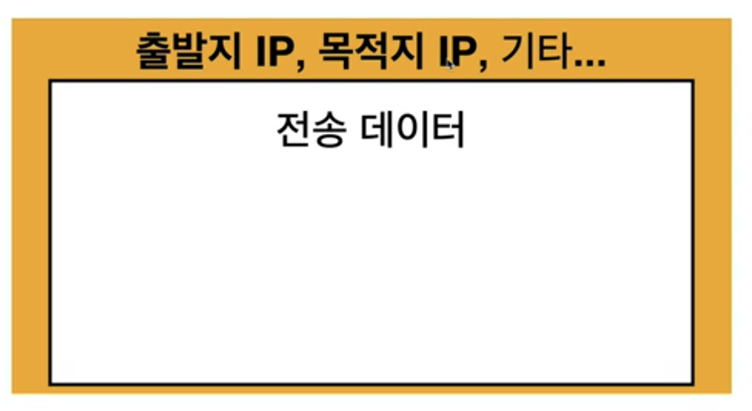
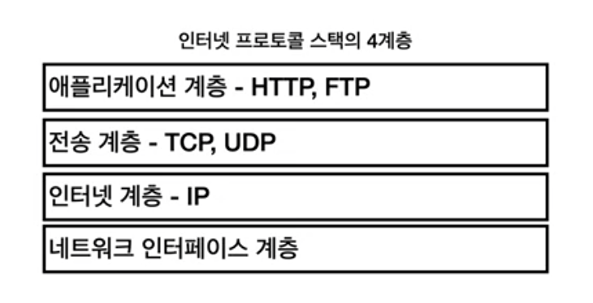
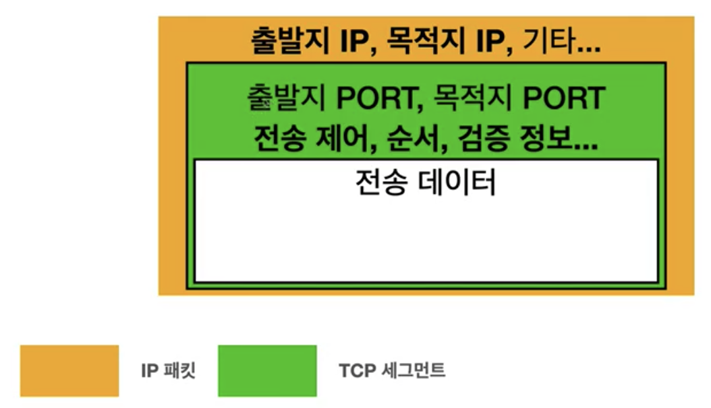
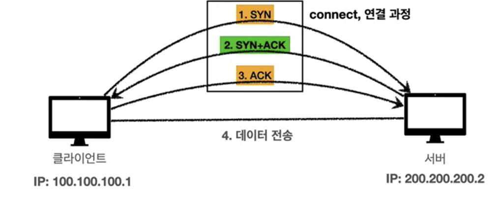
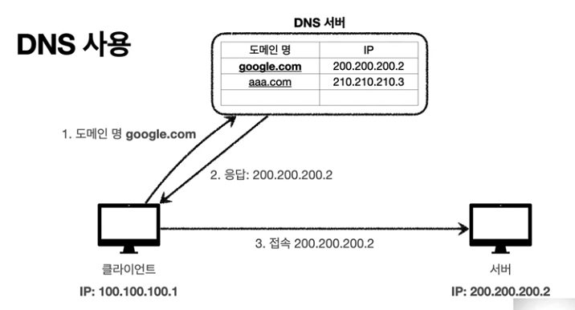

## 시작하기에 앞서

웹 개발자에게 필요한 지식은 정말 많다. 그 중 FrontEnd, BackEnd 와 상관없이 꼭 학습해야 하는 내용이 `HTTP`라고 생각한다.
블로그에 `HTTP 시리즈`로 내가 공부한 HTTP 웹 기본 지식에 관하여 정리해서 업로드하려고 한다.

현재 프론트엔드로 신입을 준비 중인 개발자들은 꼭 확인해보면 필요한 내용이니 학습했으면 좋겠다.

이 블로그에 올리는 시리즈는 [모든 개발자를 위한 HTTP 웹 기본 지식](https://www.inflearn.com/course/http-%EC%9B%B9-%EB%84%A4%ED%8A%B8%EC%9B%8C%ED%81%AC) 이라는 인프런에 있는 강의를 보고
학습한 내용을 정리하는 시리즈이니, 관심 있는 사람들은 강의를 꼭 들어보길 권장한다.

## 인터넷 통신

먼저 인터넷에서 컴퓨터끼리는 어떻게 통신할까? 우리는 항상 통신하고 있긴 하지만 어떤 것을 이용해서 통신하고 어떻게
통신 되는지는 크게 관심이 없었을 것이다. 어떻게 통신하는지 알아보기 위해 우리는 인터넷 통신에 사용되는 여러 `프로토콜`을 알 필요가 있다.

## IP(인터넷 프로토콜)

첫 번째로 알아야 할 프로토콜은 `IP` 즉 인터넷 프로토콜이다. `IP`는 개발자가 아닌 사람들도 한 번쯤은 무조건 들어봤을 단어이고,
주소? 라는 개념도 많이들 가지고 있을 것이다. `IP`는 주소만의 역할을 하는 것이 아니라 여러 역할을 하고 있다. 한번 `IP`의 역할을 알아보자.

- 지정한 IP(IP Address)에 데이터 전달
- 패킷(Packet)이라는 통신 단위로 데이터 전달

`IP`는 위의 기능을 수행하는 프로토콜이다. 그러면 위에 첫 번째 기능은 말 그대로 IP에 데이터를 전달하는 것이고, 두 번째 기능은 `패킷`이라는 통신 단위로 데이터를 전달한다고 하는데 여기서 이 `패킷`은 무엇일까?

패킷은 이렇게 생겼다.

위의 그림처럼 저런 정보가 담겨 있는 것이 패킷이라고 생각하면 된다. 그러면 이러한 `IP` 인터넷 프로토콜만 있으면 인터넷 통신이 되는 것일까? 
답은 그렇지 않다. `IP`프로토콜은 한계점을 가지고 있다. 한계점을 알아보자.

- 비연결성 : 패킷을 받을 대상이 없거나 서비스 불능 상태여도 패킷을 전송한다.
- 비신뢰성 : 중간에 패킷이 사라지면? 패킷이 순서대로 안오면?
- 프로그램 구분 : 같은 IP를 사용하는 서버에서 통신하는 애플리케이션이 둘 이상이면?

## TCP, UDP

위의 IP 프로토콜의 한계를 해결해주는 것이 바로 `TCP` 프로토콜이다. 먼저 인터넷 프로토콜의 4계층을 알아보자.

위 그림을 해석해보자. 인터넷 프로토콜은 4계층이 있으면 이러한 순서를 통해 통신하게 된다.
1. 애플리케이션 계층의 프로그램에서 전송하고자 하는 메시지를 생성한다.
2. 그리고 해당 계층의 SOCKET 라이브러리를 통해 전송계층에 전달한다.
3. 전송계층에서 TCP 정보를 생성하고 메시지 데이터를 포함하여 해당 내용을 인터넷 계층으로 넘겨준다.
4. 인터넷 계층에서는 IP 패킷을 생성하고, TCP 데이터를 포함하며 이 내용을 네트워크 인터페이스 계층으로 전달시킨다.
5. 네트워크 인터페이스 계층은 여러 장비를(LAN 카드) 통해 인터넷과 통신하며 서버에 데이터를 전송한다.

위에 `TCP`는 `IP` 프로토콜의 한계를 해결해준다고 하였다. 이것은 4단계에서 `TCP` 데이터(세그먼트)를 포함하면서 해결되며 이런 식으로
생겼다. (*인터넷 계층의 전송단위는 패킷, 전송계층의 전송단위는 세그먼트이다.)

이러한 `TCP`는 이런 특징을 가지게 된다.
- 전송 제어 프로토콜(Transmission Control Protocol)
- 연결지향(TCP 3 way handshake)
- 데이터 전달 보증
- 순서 보장
- 신뢰할 수 있는 프로토콜
- 현재는 대부분이 TCP 를 사용한다.

위의 특징에서 지켜볼 것은 연결지향인 `3 way handshake`이다.

`SYN`은 접속요청, `ACK`는 요청 수락이다. 이것을 해석해보면.
1. 데이터를 전송한다.
2. 데이터를 잘 받았다고 확인 메세지를 보낸다.
3. 알았다고 확인을 보낸다. 

이렇게 진행되는 것이 `TCP`의 `3way handshake`로 이것의 장점은 순서를 보장한다. 예를 들어. 패킷의 순서가 잘못됬다고 가정해보자.
1. 패킷을 (1,2,3)으로 보냈다.
2. 패킷이 (1,3,2)로 도착했다.
3. 패킷을 2부터 다시 보내라고 요청한다.

이것이 `TCP`이며 우리는 같은 계층의 프로토콜인 `UDP`에 대해서도 알아볼 필요가 있다. `UDP`는 간단하게 특징만 알아보자.

- 사용자 데이터그램 프로토콜(User Datagram Protocol)
- 기능이 거의 없다.
- 비연결지향
- 데이터 전달 보증을 안한다.
- 순서를 보장하지 않는다.
- 단순하고 속도가 빠르다.

위의 내용을 정리하면 `UDP`는 `IP` 프로토콜과 거의 같다. 실시간 통신을 할때 주로 사용되며, 
최근에는 웹 브라우저에서 `http3 3way handshake`를 줄여보자 해서 `UDP`프로토콜이 주목받고 있다.

## PORT

한번에 둘 이상을 연결해야 한다면 어떻게 해야 할까? 예시로 클라이언트 하나에서 게임을 하면서, 화상통화를 하며, 메신저를 주고받을 수도 있다.
이 경우 사용되는 것이 바로 `PORT`이다. `IP`가 목적지의 주소를 찾는 역할을 한다면 `PORT`는 목적지 안에서 구분되는 것이라고 보면 된다.

`PORT` 번호는 몇 개는 자주 사용되니 기억해 놓는 것이 좋다. 밑의 특징만 확인하자.
- 0 ~ 65535 : 할당 가능한 포트
- 0 ~ 1023 : 잘알려진 포트로 사용하지 않는 것이 좋다.
    - FTP : 20, 21
    - TELNET : 23
    - HTTP : 80
    - HTTPS : 443

## DNS

마지막으로 알아야 하는 것은 `DNS`이다. `DNS` 란 도메인 네임 시스템(Domain Name System)의 약자로 전화번호부 같은
역할을 한다. 먼저 그림을 보자.

먼저 처음으로 돌아가 `DNS`는 왜 사용되는 것일까? 위에서 배운 `IP`로 접근하면 되는 것 아닐까? 라고 생각할 수도 있다.
`IP`는 변경될 수 있으며 기억하기 어려운 특징을 가진다. 이렇기 때문에 우리는 www.google.com 같은 도메인 주소를 기억하고 이를 통해 웹페이지에 접속한다.
그럼 간단하게 해당 도메인명이 IP 주소와 연결되어 있다고 생각하자. 예를 들어 우리가 사용하는 google 의 IP는 200.200.200.2라고 가정해보자.

우리의 실생활로 전화번호부를 생각할 수 있다. 우리가 전화를 할 때 전화번호로 입력해서 전화하는 것이 얼마나 될까? 대부분 전화번호부에 저장된 이름으로 전화를 할 것이다. `DNS`도 마찬가지다. `IP`를 가지고 있는 전화번호부로 우리가 사용하는 이름 대신 도메인 주소와 매핑해 저장시켜주는 것이다. 

위의 예시는 

<b>google.com : 200.200.200.2</b>

로 저장되며 이를 활용하면 이런식의 흐름으로 진행된다.

1. google.com에 접속
2. google에 해당하는 ip주소를 응답 받음.
3. 해당 ip로 접속

## 🌜 마무리

가장 기본이 되는 인터넷 통신과 인터넷 통신을 하기 위해 필요한 여러 프로토콜을 다뤄보았다. 다음에는
URL과 웹 브라우저의 요청 흐름이 대해 다뤄볼 예정이다.

 