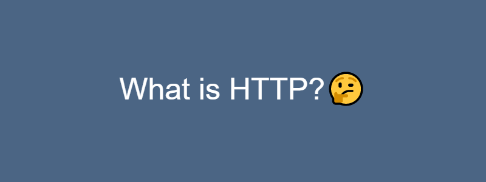
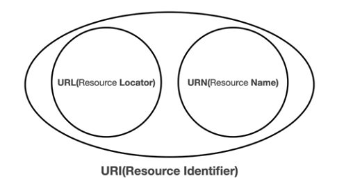
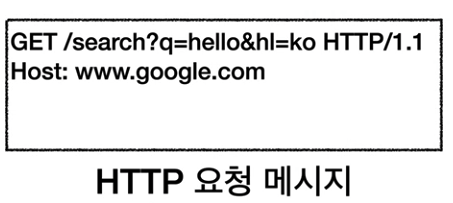
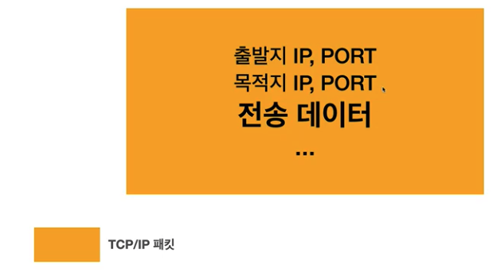
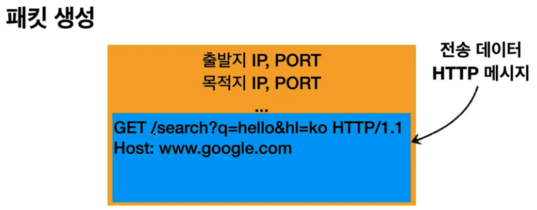
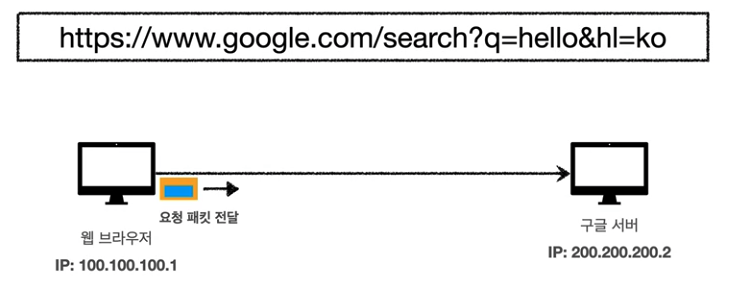
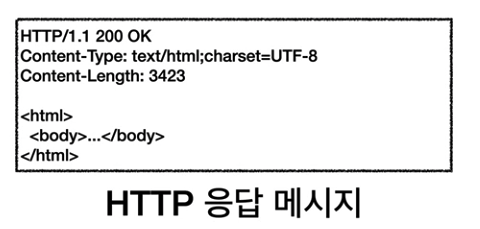
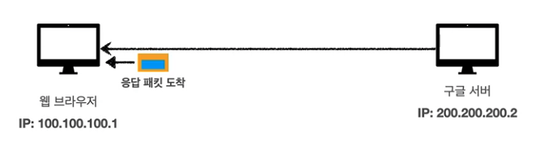

## URL

URL(Uniform Resource Identifier)`이라는 단어를 한 번쯤 들어봤을 것이다. `URL`은 웹을 뒷받침하는 주소체계이다.

그런데 `URL`말고도 `URI`, `URN`이라는 단어를 들어봤을 것이다. 아마 단어별로 어떤 것이 다른 건지 모르는 사람들이 많을 것이다.

가장 먼저 크게 분류되는 `URI`를 알아보자. `URI`는 `URL`과 `URN`을 모두 포함하고 있는 것으로 로케이터, 이름 또는 둘 다 추가로 분류될 수 있다.

그럼 이제 세 단어의 뜻에 대해 자세히 알아보자.

### URI 의 뜻
- Uniform : 리소스를 식별하는 통일된 방식
- Resource : 자원, URI 로 식별할 수 있는 모든 것
- Identifier : 다른 항목과 구분하는데 필요한 정보
- URL : Uniform Resource Locator
- URN : Uniform Resource Name

### URL 과 URN
- URL : Locator 로 리소스가 있는 위치를 지정한다.
- URN : NAME 으로 리소스에 이름을 부여한다.
- 위치는 변할 수 있지만, 이름은 변하지 않는다.
- URN 이름만으로 실제 리소스를 찾을 수 있는 방법이 보편화되지 않았다.
- URI 와 URL 을 같은 의미로 생각해도 된다.

예시 `URL`을 분석해보자.

`https://www.google.com:443/search?q=hello&hl=ko`

- 프로토콜 -> `https`
- 호스트명 -> `www.google.com`
- 포트번호 -> `443`
-    패스 -> `/search`
- 쿼리 파라미터 -> `q=hello&hl=ko`

이렇게 분리되어 해석할 수 있다. `URL`의 문법은 이렇게 해석된다.

`scheme://[userinfo@]host[:port][?query][#fragment]`

이제 각 항목별로 무엇을 나타내는지 알아보자.

### scheme
- 주로 프로토콜 사용
- 프로토콜 : 어떤 방식으로 자원에 접근할 것인가 하는 약속(규칙)
- http 는 80, https 는 443 포트를 주로 사용한다.
- https 는 http 에 보안을 추가한 것이다.(HTTP Secure)

### userinfo
- URL 에 사용자정보를 포함해서 인증한다.
- 거의 사용하지 않는다.

### host
- 호스트명
- 도메인명 또는 IP 주소를 직접 사용 가능하다.

### port
- 접속 포트
- 일반적으로 생략하며 생략시 http 는 80, https 는 443을 이용한다.

### path
- 리소스 경로(path), 계층적 구조
- 예) /login, /my/webtoon

### query
- key=value 형태이다.
- ?로 시작하며, &로 추가 가능하다.
- query parameter, query string 등으로 불린다. 웹서버에 제공하는 파라미터, 문자 형태이다.

### fragment
- html 내부 북마크 등에 사용한다.
- 서버에 전송하는 정보는 아니다.
- 같은 페이지에서 이동을 할때 주로 활용된다. 

## 웹 브라우저 요청 흐름

이번 챕터에서 가장 중요한 것은 이 웹브라우저의 요청 흐름이다. 순서대로 살펴보자.

먼저 `https://www.google.com/search?q=hello&hl=ko` 를 웹 브라우저에 입력하면 어떤 현상이 발생할까?

1. 첫번째로 DNS 를 조회하여 `www.google.com` 의 ip주소를 받아온다. 
2. 웹브라우저가 HTTP 요청 메시지를 생성한다.

3. 해당 메세지를 Socket 라이브러리를 통해 전송계층에 전달한다.
4. 전송계층과 네트워크 계층에서 HTTP 메시지가 포함된 TCP/IP 패킷을 생성하고 네트워크 계층으로 보낸다.
5. 네트워크 계층은 인터넷을 통해 해당 서버로 요청 메시지를 전달한다.

6. 구글 서버에서 요청 패킷을 받고 응답 패킷을 전달한다.

7. 웹 브라우저는 응답 패킷을 받아 해석하고 HTML 렌더링을 시킨다.

## 🌜 마무리

가장 중요한 개념 중 하나인 URL과 웹 브라우저의 요청 흐름에 대해서 알아보았다. 특히
웹 브라우저 요청 흐름은 요즘 면접에서도 자주 물어보는 질문 중 하나라고 하니 신입 개발자들은 잘 알고 있으면 좋겠다.
다음에는 HTTP의 기본에 대해서 다뤄볼 예정이다.

 
