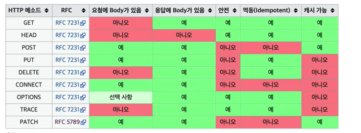

## 🧩 HTTP API 만들어보기

HTTP 메서드를 알아보기 전 요구사항을 보고 생각나는 대로 API를 설계해보겠다.

- 요구사항 : 회원 정보 관리 API 를 만들어라
    - 회원 목록 조회
    - 회원 조회
    - 회원 등록
    - 회원 수정
    - 회원 삭제
    
아무것도 모르는 상태에서 URL을 설계할 경우에는 이런 식으로 할 수 있을 것이다.

- API URL 설계
    - 회원 목록 조회 : /read-member-list
    - 회원 조회 : /read-member/by-id
    - 회원 등록 : /create-member
    - 회원 수정 : /update-member
    - 회원 삭제 : /delete-member
    
위의 URL 설계는 과연 좋은 URL 설계일까? URL을 설계할 때 중요한 것은 리소스를 식별하는 것이다. 그럼 이 `리소스`란 무엇일까?
단순히 회원을 등록하고 수정하고 조회하는 것이 리소스가 아니다. 위 예제에서는 회원이라는 개념 자체가 바로 `리소스`가 되는 것이라 생각하면 된다.

이 `리소스`를 어떻게 식별하는 것이 좋은 방법일까? 두가지로 생각해보자.
- 회원을 등록하고 수정하고 조회하는 것을 모두 배제
- 회원이라는 리소스만 식별하면 된다. -> 회원 리소스를 URL에 매핑

위의 생각대로 다시 URL을 설계해보자.

- API URL 설계
    - 회원 목록 조회 : /members
    - 회원 조회 : /members/{id}
    - 회원 등록 : /members/{id}
    - 회원 수정 : /members/{id}
    - 회원 삭제 : /members/{id}
    
정말 간단하다. 그럼 이 URL들은 보기에는 똑같이 생겼는데 어떻게 구분을 할까? URL은 리소스만 식별하는 역할을하며 리소스와 해당 리소스를 대상으로 하는 행위를 분리시켜야 한니다.
행위는 어떻게 구분할까? 바로 `HTTP 메서드(GET, POST, PUT, DELETE, PATCH)`를 이용하면 된다.

## 🧩 HTTP 메서드 - GET, POST

HTTP 에서는 크게 5가지 메서드가 존재한다.
- GET : 리소스 조회
- POST : 요청 데이터 처리, 주로 등록에 사용
- PUT : 리소스를 대체, 해당 리소스가 없으면 생성
- PATCH : 리소스 부분 변경
- DELETE : 리소스 삭제

이외의 기타 메서드로는 이런 것들이 있다.
- HEAD : GET 과 동일하지만 메시지 부분을 제외하고, 상태줄과 헤더만 반환
- OPTIONS : 대상 리소스에 대한 통신 가능 옵션(메서드)을 설명(주로 CORS에서 사용한다.) 
- CONNECT : 대상 자원으로 식별되는 서버에 대한 터널을 설정
- TRACE : 대상 리소스에 대한 경로를 따라 메시지 루프백 테스트를 수행

그중에서 가장 먼저 `GET` 메서드에 대해서 알아보겠다. `GET` 메서드란 리소스를 조회할 때 사용하며 서버에 전달하고 싶은 데이터는
query(쿼리 파라미터, 쿼리 스트링)을 통해서 전달한다. 메시지 바디를 사용해서 데이터를 전달할 수도 있지만 지원하지 않는 곳이 많아 권장하지는 않는다.

`GET`은 이런 3단계를 가진다.
1. 클라이언트에서 GET /members/100 요청
2. 서버에서 GET 요청을 받아들인다.
3. 서버에서 응답데이터를 반환한다.

이것이 `GET`메서드의 모든 것이다. 정말 간단하다.

다음으로 `POST`메서드에 대해 알아보겠다. `POST` 메서드는 요청 데이터를 처리할 때 사용하며, 메시지 바디를 통해 서버로 요청 데이터를 전달한다.
서버는 이렇게 받은 요청 데이터를 처리하게 되며 메시지 바디를 통해 들어온 데이터를 처리하는 모든 기능을 수행한다. `POST`는 주로 전달된 데이터로 신규 리소스 등록, 프로세스 처리에 사용한다.

`POST`는 이런 3단계를 가진다.
1. 클라이언트에서 메시지를 전달한다.
2. 서버에서는 클라이언트에서 받은 메시지를 통해 신규 리소스를 생성한다.
3. 서버는 클라이언트에게 응답을 반환한다.

`POST`를 정리해보자.
1. 새 리소스를 생성(등록)할 때 사용한다.
   - 서버가 아직 식별하지 않은 새 리소스 생성
2. 요청 데이터 처리
    - 단순히 데이터를 생성하거나, 변경하는 것을 넘어서 프로세스를 처리해야 하는 경우
    - 예) 주문에서 결제완료 -> 배달시작 -> 배달 완료 처럼 단순히 값 변경을 넘어 프로세스의 상태가 변경되는 경우
    - POST 의 결과로 새로운 리소스가 생성되지 않을 수도 있다.
        - 예) POST /orders/{orderId}/start-delivery/{컨트롤 URI}
3. 다른 메서드로 처리하기 애매한 경우
    - 예) JSON 으로 조회 데이터를 넘겨야 하는데, GET 메서드를 사용하기 어려운 경우 
    - 애매하면 POST를 사용한다.
    
## 🧩 HTTP 메서드 - PUT, PATCH, DELETE

`PUT` 메서드는 리소스를 대체 할 때 사용한다. 하지만 이 대체라는 개념을 잘 알고 있어야 `POST`, `PATCH`와 헷갈리지 않을 수 있다.

`PUT`은 이렇게 동작한다.
- 리소스가 있으면 대체
- 리소스가 없으면 생성
- 쉽게 이야기해서 덮어버린다.
- POST와 차이점
    - 클라이언트가 리소스 위치를 알고 URL을 지정한다.
    
다음으로 비슷한 `PATCH`를 알아보자. `PATCH`는 쉽게 `PUT`의 단점을 해결해주는 것이라고 생각하면 된다.

```json
{
  "username": "lee",
  "age": 24
}
```

```json
{
  "username": "kim"
}
```

`PUT`의 단점은 위처럼 요청하게 되면, 새로운 데이터로 덮혀져서 age 필드가 삭제되게 된다. 이런 단점을 보안한 것이 바로 `PATCH`다.

`PATCH`는 아직 지원이 안되는 서버들이 있다. 이런 경우에는 `POST`를 사용하면 된다.

마지막으로 알아볼 메서드는 `DELETE`다. `DELETE`는 말그대로 리소스를 제거할 때 사용된다.

## 🧩 HTTP 메서드의 속성

메서드의 속성은 크게 3가지라고 생각하면 된다.
- 안전(Safe Methods)
- 멱등(Idempotent Methods)
- 캐시가능(Cacheable Methods)

### 🎯 안전이란?
- 호출해도 리소스를 변경하지 않는 것
- Q: 그래도 계속 호출해서, 로그 같은게 쌓여서 장애가 발생하면 어떻게?
- A: 안전은 해당 리소스만 고려한다. 그런 부분까지는 고려하지 않는다.

### 🎯 멱등이란?
- f(f(x)) = f(x)
- 한 번 호출하든 두 번 호출하든 100번 호출하든 항상 결과가 똑같다.
- 멱등 메서드
    - GET : 한번 조회하든, 두번 조회하든 같은 결과가 조회된다.
    - PUT : 결과를 대체한다. 따라서 같은 요청을 여러번 해도 최종 결과는 같다.
    - DELETE : 결과를 삭제한다. 같은 요청을 여러번 해도 삭제된 결과는 똑같다.
    - POST : 멱등이 아니다! 두번 호출하면 같은 결제가 중복해서 발생할 수 있다.
- 활용
    - 자동 복구 매커니즘
    - 서버가 Timeout 등으로 정상 응답을 못주었을 때, 클라이언트가 같은 요청을 다시해도 되는가?
- Q : 재요청 중간에 다른 곳에서 리소스를 변경해버리면?
    - 사용자1 : GET → username: A, age:20
    - 사용자2 : PUT → username:A, age:30
    - 사용자1 : GET → username:A, age:30 → 사용자2의 영향으로 바뀐 데이터 조회
- A: 멱등은 외부 요인으로 중간에 리소스가 변경되는 것 까지는 고려하지는 않는다.

### 🎯 캐시가능이란?
- 응답 결과 리소스를 캐시해서 사용해도 되는가?
- GET, HEAD, POST, PATCH 캐시가능
- 실제로는 GET, HEAD정도만 캐시로 사용
    - POST, PATCH는 본문 내용까지 캐시 키로 고려해야 하는데, 구현이 쉽지 않음

HTTP 메서드의 속성을 확인하고 이 표를 보고 확인해보자.



## 🧩 (활용)클라이언트에서 서버로 데이터 전송

데이터 전달 방식은 크게 2가지가 있다.
1. 쿼리 파라미터를 통한 데이터 전송
    - GET
    - 주로 정렬 필터(검색어)
2. 메시지 바디를 통한 데이터 전송
    - POST, PUT, PATCH
    - 회원가입, 상품 주문, 리소스 등록, 리소스 변경
    
4가지 예시 상황을 보자.
- 정적 데이터 조회
    - 이미지, 정적 텍스트 문서
- 동적 데이터 조회
    - 주로 검색, 게시판 목록에서 정렬 필터(검색어)
- HTML Form 을 통한 데이터 전송
    - 회원가입, 상품주문, 데이터 변경
- HTTP API를 통한 데이터 전송
    - 회원 가입, 상품 주문, 데이터 변경
    - 서버 to 서버, 앱 클라이언트, 웹 클라이언트(Ajax)

### 🎯 정적 데이터 조회 정리
- 이미지, 정적 텍스트 문서
- 조회는 GET을 사용한다.
- 정적 데이터는 일반적으로 쿼리 파라미터 없이 리소스 경로로 단순하게 조회 가능하다.

### 🎯 동적 데이터 조회 정리
- 주로 검색, 게시판 목록에서 정렬 필터(검색어)
- 조회 조건을 줄여주는 필터, 조회 결과를 정렬하는 정렬 조건에 주로 사용한다.
- 조회는 GET 사용
- GET 은 쿼리 파라미터 사용해서 데이터를 전달

### 🎯 HTML Form 데이터 전송
- HTML Form submit시 POST 전송
- Content-Type: application/x-www-form-urlencoded 사용
    - form 내용을 메시지 바디를 통해서 전송
    - 전송 데이터를 url encoding 처리
- HTML Form은 GET 전송도 가능하다.
- Content-Type : multipart/form-data
    - 파일 업로드 같은 바이너리 데이터 전송시 사용
    - 다른 종류의 여러 파일과 폼의 내용 함께 전송 가능
- 참고 : HTML Form 전송은 GET, POST 만 지원한다.

### 🎯 HTTP API 데이터 전송 정리
- 서버 to 서버
    - 백엔드 시스템 통신
- 앱 클라이언트
    - 아이폰, 안드로이드
- 웹 클라이언트
    - HTML에서 Form 전송 대신 자바 스크립트를 통한 통신에 사용(AJAX)
    - 예) React, VueJs 같은 웹 클라이언트와 API 통신
- POST, PUT, PATCH : 메시지 바디를 통해 데이터 전송
- GET : 조회, 쿼리 파라미터로 데이터 전달
- Content-Type: application/json을 주로 사용(사실상 표준)
    - TEXT, XML, JSON 등등
    
## 🧩 마무리

이번에는 `HTTP 메서드`에 대해서 알아보았다. 

<br/>