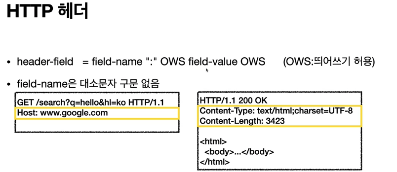

## HTTP 헤더

`HTTP 헤더`는 이런식으로 생겼다.

헤더의 용도는 이렇게 된다.
- HTTP 전송에 필요한 모든 부가정보를 담는다.
- 예) 메시지 바디의 내용, 메시지 바디의 크기, 압축, 인증, 요청 클라이언트, 서버 정보, 캐시 관리 정보 등
- 표준 헤더가 너무 많다.
- 필요시 임의의 헤더가 추가 가능하다.

과거 사용했던 `RFC2616`의 `HTTP 헤더`는 이러했다.

헤더 분류
- General 헤더 : 메시지 전체에 적용되는 정보 -> 예) Connection: close
- Request 헤더 : 요청 정보 -> 예) User-Agent: Mozilla/5.0
- Response 헤더 : 응답 정보 -> 예) Server: Apache
- Entity 헤더 : 엔티티 바디 정보 -> 예) Content-Type: text/html, Content-Length: 3423
HTTP BODY
- 메시지 본문은 엔티티 본문을 전달하는데 사용된다.
- 엔티티 본문은 요청이나 응답에서 전달할 실제 데이터이다.
- 엔티티 헤더는 엔티티 본문의 데이터를 해석할 수 있는 정보를 제공한다. -> html, json, 데이터 길이 등

이랬던 `RFC2616`이 폐기되고 `RFC7230` ~ `RFC7235`가 등장하였다.

RFC723x 의 변화
- 엔티티(Entity) -> 표현(Representation)
- Representation = representation Metadata + representation data
- 표현 = 표현 메타디이터 + 표현 데이터
- 메시지 본문을 통해 표현 데이터를 전달하였다.
- 메시지 본문 = 페이로드(payload)
- 표현은 요청이나 응답에서 전달할 실제 데이터이다.
- 표현 헤더는 표현 데이터를 해석할 수 있는 정보를 제공한다.
  - 데이터 유형, 데이터 길이, 압축 정보 등

## HTTP 표현 헤더

표현헤더는 전송과 응답 둘 다 사용된다.

- Content-Type : 표현 데이터의 형식
- Content-Encoding : 표현데이터의 압축방식
- Content-Language : 표현 데이터의 자연 언어
- Content-Length : 표현 데이터의 길이

첫 번째로 알아볼 것은 `Content-Type`이다. `Content-Type`은 표현 데이터의 형식을 설명한다.
- 미디어 타입, 문자 인코딩
- 예)
  - text/html; charset=utf-8
  - application/json
  - image/png
  

두 번째로 알아볼 것은 `Content-Encoding`이다. `Content-Encoding`은 표현 데이터 인코딩이다.
- 표현 데이터를 압축하기 위해 사용
- 데이터를 전달하는 곳에서 압축 후 인코딩 헤더 추가
- 데이터를 읽는 쪽에서 인코딩 헤더의 정보로 압축 해제
- 예)
  - gzip
  - deflate
  - identity
  
세 번째로 알아볼 것은 `Content-Language`이다. `Content-Language`는 표현 데이터의 자연 언어를 표현한다.
- 표현 데이터의 자연 언어를 표현
- 예)
  - ko
  - en
  - en-US

네 번째로 알아볼 것은 `Content-Length`이다. `Content-Length`는 표현 데이터의 길이이다.
- 바이트 단위
- Transfer-Encoding(전송 코딩)을 사용하면 Content-Length 를 사용하면 안된다.

## 콘텐츠 협상

`협상(콘텐츠 네고시에이션)`은 클라이언트가 선호하는 표현 요청이다.
- Accept : 클라이언트가 선호하는 미디어 타입 전달
- Accept-Charset : 클라이언트가 선호하는 문자 인코딩
- Accept-Encoding : 클라이언트가 선호하는 압축 인코딩
- Accept-Language : 클라이언트가 선호하는 자연 언어
- 협상 헤더는 요청시에만 사용한다.

## 전송 방식

전송방식은 말그대로 전송 방식이며 크게 4가지가 있다.
- 단순 전송(Content-Length)
- 압충 전송(Content-Encoding)
- 분할 전송(Transfer-Encoding)
- 범위 전송(Range, Content-Range)

## 일반 정보

일반 정보는 이러한 것들이 있으며 한번씩 확인해보면 된다.

***From***

- 유저 에이전트의 이메일 정보
- 일반적으로 잘 사용되지 않음
- 검색 엔진 같은 곳에서, 주로 사용
- 요청에서 사용

***Referer***

- 이전 웹 페이지 주소
- 현재 요청된 페이지의 이전 웹 페이지 주소
- A → B로 이동하는 경우 B를 요청할 때 Referer: A를 포함해서 요청
- Referer 를 사용해서 유입 경로 분석 가능
- 요청에서 사용
- 참고 : referer 는 단어 referrer 의 오타

***User-Agent***

- 유저 에이전트 애플리케이션 정보
- 클라이언트의 애플리케이션 정보(웹 브라우저 정보 등)
- 통계 정보
- 어떤 종류의 브라우저에서 장애가 발생하는지 파악 가능
- 요청에서 사용

***Server***

- 요청을 처리하는 ORIGIN 서버의 소프트웨어 정보
- Server: Apache/2.2.22(Debian)
- server: nginx
- 응답에서 사용

***Date***

- 메시지가 발생한 날짜와 시간
- 응답에서 사용

## 특별한 정보

특별한 정보는 크게 4가지가 존재한다.
- Host : 요청한 호스트 정보(도메인)
- Location : 페이지 리다이렉션
- Allow : 허용 가능한 HTTP 메서드
- Retry-After : 유저 에이전트가 다음 요청을 하기까지 기다려야 하는 시간

***Host***

- 요청한 호스트 정보(도메인)
- 요청에서 사용
- 필수
- 하나의 서버가 여러 도메인을 처리해야 할 때
- 하나의 IP 주소에 여러 도메인이 적용되어 있을 때가 있음

***Location***

- 페이지 리다이렉션
- 웹브라우저는 3xx 응답의 결과에 Location 헤더가 있으면, Location 위치로 자동 이동(리다이렉트)
- 응답코드 3xx에서 설명
- 201 (Created): Location 값은 요청에 의해 생성된 리소스 URI
- 3xx (Redirection) : Location 값은 요청을 자동으로 리다이렉션하기 위한 대상 리소스를 가리킨다.

***Allow***

- 허용 가능한 HTTP 메서드
- 405 (Method Not Allowed)에서 응답에 포함해야 한다.
- Allow: GET, HEAD, PUT

***Retry-After***

- 유저 에이전트가 다음 요청을 하기까지 기다려야 하는 시간
- 503 (Service Unavailable): 서비스가 언제까지 불능인지 알려줄 수 있다.
- Retry-After: Fri, 31 Dec 1999 21:59:10GMT(날짜표기)
- Retry-After: 120(초단위 표기)

## 인증

인증은 인증을 위해서 사용하며 크게 2가지가 있다.
- Authorization : 클라이언트 인증 정보를 서버에 전달
- WWW-Authenticate : 리소스 접근시 필요한 인증 방법 정의

***Authorization***

- 클라이언트 인증 정보를 서버에 전달
- Authorization : Basic xxxxxxxx

***WWW-Authenticate***

- 리소스 접근시 필요한 인증 방법 정의
- 401 Unauthorized 응답과 함께 사용

## 🌜 마무리

전반적인 HTTP 에 대해서 살펴보았다. 

 