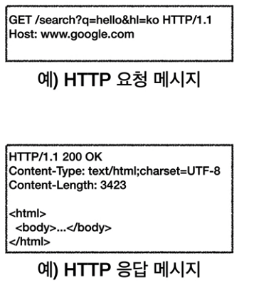

## HTTP

처음 포스팅에서 `HTTP(HyperText Transfer Protocol)`은 모든 것을 전송한다고 말했었다. 과연
어떤 것들이 전달 가능할까?

- HTML, TEXT
- IMAGE, 음성, 영상, 파일
- JSON, XML(API)
- 거의 모든 형태의 데이터가 전송 가능하다.
- 서버간에 데이터를 주고 받을 때도 대부분 HTTP를 사용한다.

이렇게 모든 데이터가 전송가능한 `HTTP`는 현재 `HTTP`의 시대라고 불릴만큼 많이 사용된다. 
그럼 이 `HTTP`의 역사는 어떻게 될까?

- HTTP/0.9 : 1991년 개발, GET 메서드만 지원하며 HTTP 헤더가 없다.
- HTTP/1.0 : 1996년 개발, 메서드와 헤더를 추가하였다.
- HTTP/1.1 : 1997년 개발, 현재 가장 많이 사용되고 있으며 가장 중요한 버전이다.
- HTTP/2 : 2015년 개발, 성능 개선된 버전이다.
- HTTP/3 : 현재 진행중, TCP 대신 UDP를 사용하며 성능이 개선된 버전이다.

그럼 위 버전들에 기반한 프로토콜은 어떻게 될까?

- TCP : HTTP/1.1
- UDP : HTTP/3
- 현재 HTTP/1.1을 주로 사용하며 이후 버전도 점점 증가하는 추세이다.

이러한 역사를 가진 `HTTP`의 특징에 대해 알아보자.

- 클라이언트 서버 구조
- 무상태 프로토콜(스테이리스), 비연결성
- HTTP 메시지
- 단순함, 확장 가능

`HTTP`의 특징에 대해 하나씩 살펴보자.

 

## 클라이언트 서버 구조

가장 먼저 알아볼 것은 `클라이언트 서버 구조`이다. `Request Response 구조`라고도 부르는 이 구조는 
말 그대로 클라이언트는 서버에 요청을 보내고 응답을 대기하고 서버에서는 요청에 대한 결과를 만들어 응답하는 구조이다.

이런식의 분리로 인해 클라이언트, 서버 양쪽 모두 독립적으로 발전하였다.

 

## 무상태 프로토콜

두번째로 알아볼 것은 `무상태 프로토콜`이다. `스테이스리스(Stateless)`라고도 부르며 서버가 클라이언트의 상태를 보존하지 않는 것을 의미한다.
이러한 무상태 프로토콜은 서버의 확장성이 높다는 장점을 가지지만 클라이언트가 추가적으로 데이터를 전송해야 한다는 단점도 가지게 된다.

`Stateless`와 반대되는 것으로 `Stateful`이 있으며 두가지를 비교해보자.

먼저 3단계로 가정하여 생각해보자. `Stateful`상태는 예시로 신발가게에서 점원이 손님에게 신발을 판다고 생각해보자.
1. 신발 얼마인가요? -> 30만원입니다.
2. 2개 구매하겠습니다 -> 결제수단은 어떻게 될까요?
3. 신용카드로 하겠습니다. -> 결제 완료되었습니다. 감사합니다.

그럼 이 단계들이 진행될때 중간에 점원이 바뀐다고 생각해보자. 제대로 진행되지 않을 것이다. 이것이 바로 상태 유지이다.
처음에 주문을 받은 점원은 어떤 신발을 구매하는지 결제수단이 어떤것인지 다 기억하고 있다. 하지만 점원이 바뀌게 되면 이를 모르게된다. 이것이
바로 `Stateful`의 개념이다. 그럼 `Stateless`는 무엇일까?

마찬가지로 3단계로 해보자.
1. 이 조던 얼마인가요? -> 50만원입니다.
2. 조던 2개 구매하겠습니다. -> 100만원입니다. 결제수단은 어떻게 될까요?
3. 조던 2개를 신용카드로 구매하겠습니다. -> 100만원 결제 완료되었습니다.

이런 흐름을 가지는게 바로 `Stateless`다. `Stateless`는 중간에 점원이 바뀌어도 전혀 문제 없이 거래가 진행된다.

위의 개념이 `Stateful`, `Stateless`의 차이이다.

서버로 예를들어 `Stateful`은 항상 같은 서버가 유지 되어야 하는 것으로 중간에 장애 발생 시 응답을 받아오지 못한다. 하지만 
`Stateless`의 경우 아무 서버나 호출해도 되며 중간에 장애 발생시 다른 서버에서 데이터를 전달 받는다.

말로는 `Stateless`가 엄청 좋아보이지만 `Stateless`도 실무적 한계를 가진다.
- 모든 것을 무상태로 설계할 수 있는 경우도 있고, 없는 경우도 있다.
- 무상태서비스의 예로는 로그인이 필요 없는 단순한 서비스 소개화면이다.
- 상태를 유지한다는 것 -> 로그인
- 일반적으로 브라우저에서는 쿠키와 세션등을 사용해 상태를 유지한다.
- 상태 유지는 최소한만 사용해야 한다.
- 단점 : 데이터를 너무 많이 보낸다.(상태를 저장하지 않기 때문에)

 

## 비연결성

`HTTP` 는 기본이 연결을 유지하지 않는 모델이다. 연결을 유지하게 되면 서버는 연결을 계속 유지해야하며,
서버 자원이 계속 소모되게 된다. 이런 비연결성의 특징은 이렇다.

- 일반적으로 초 단위 이하의 빠른 속도로 응답한다.
- 1시간에 수천명이 서비스를 사용해도 실제 서버에서 동시에 처리하는 요청은 수십개이하로 매우 작다.
- 서버 자원을 매우 효율적으로 사용할 수 있다.

이러한 비연결성에는 한계가 있으며 이를 극복하는 방법도 존재한다.

- TCP/IP 연결을 새로 맺어야 한다. -> 3 way handshake 시간 추가
- 웹 브라우저로 사이트를 요청하면 HTML 뿐만 아니라 자바스크립트, css, 추가 이미지 등 수 많은 자원이 함께 다운로드 된다. -> HTTP 지속 연결로 문제 해결
- HTTP/2, HTTP/3에서 더 많이 최적화되었다.

 

## HTTP 메시지

먼저 `HTTP` 요청과 응답 메시지의 형태를 알아보자.

요청 메시지부터 하나하나 분석해보자.

먼저 요청 메시지의 시작라인은 크게 3개의 정보가 들어가 있다. (HTTP 메서드, 요청 대상, HTTP Version)

<b>HTTP 메서드</b>
- 종류 : GET, POST, PUT, DELETE
- 서버가 수행해야 할 동작을 지정한다.

<b>요청 대상</b>
- absolute-path[?query]
- 절대 경로 = "/" 로 시작하는 경로

<b>HTTP 버전</b>
- HTTP Version

응답 라인의 시작라인을 알아보면 응답라인은 
- HTTP 버전
- HTTP 상태 코드 : 요청 성공, 실패를 나타냄
- 이유 문구 : 사람이 이해할 수 있는 짧은 상태 코드와 설명 글

다음은 `HTTP` 헤더의 특징에 대해서 알아보자.
- 띄어쓰기 허용
- field-name 은 대소문자 구문 없음
- HTTP 전송에 필요한 모든 부가정보를 담음
- 예) 메시지 바디의 내용, 메시지 바디의 크기, 압축, 인증, 요청 클라이언트(브라우저) 정보, 서버 애플리케이션 정보, 캐시 정보 등
- 표준 헤더가 너무 많다.
- 필요시 임의의 헤더를 추가 가능하다.

다음은 `HTTP` 메시지 바디의 용도에 대해 알아보자.
- 실제 전송할 데이터다.
- HTML 문서, 이미지, 영상, JSON 등등 byte 로 표현할 수 있는 모든 데이터가 전송 가능하다.

 

## 🌜 마무리

이번 포스팅에서는 `HTTP`의 기본에 대해 다뤄보았다. 알아보니 `HTTP`는 정말 단순한 것 같다. 스펙도 읽어볼만
하다고 하는데, 나는 읽고 싶지는 않다...😂 다음 포스팅에서는 `HTTP 메서드`에 대해서 다뤄볼 예정이다. 많은 관심 부탁드린다.

 